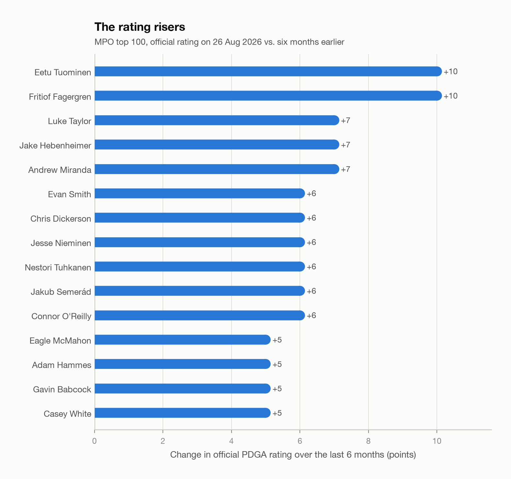
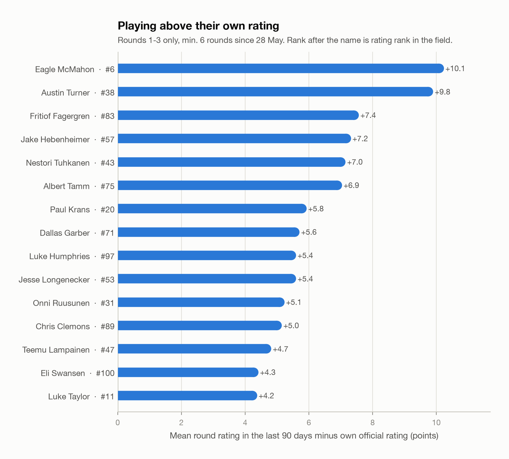
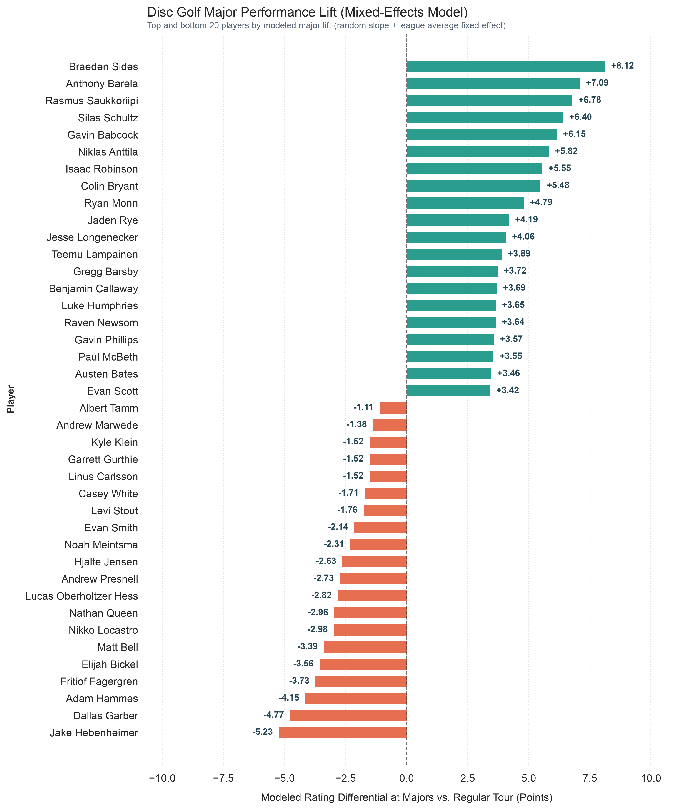

In a few hours the [2026 Disc Golf World Championship](https://www.detroit26.com/) will be underway!
Instead of focusing on the most dominant and established players, I will try to identify less obvious players that might come in hot and throw a couple of amazing rounds.

*Note: I will only work with MPO data to keep it concise for me, because I started this project a bit late 🫠 But let me know if I should repeat the analysis for FPO.*

## The data
To do this analysis, I fetched
- the top 100 players by rating
- all players rating history
- all players Elite Series and Major round ratings

There is an official [PDGA REST API](https://www.pdga.com/dev/api/rest/v1/services) but the provided endpoints are not sufficient for the data required, so scraping it is.

## The analysis
I decided to look at two metrics to identify interesting players:
- Who is trending right now?
- Who performs exceptionally well at Majors?

Let's start with the first:

### Who is trending right now?
The [DGPT season](https://www.dgpt.com/announcements/2026-schedule/) started on 27th February, almost exactly 6 months ago. Of course, not all international players started with that event, but let's see who has increased their rating the most since then:

We can see a couple of European up-and-coming players followed by Americans such as Luke Taylor who just recently [won his first ever Elite Series event](https://www.dgpt.com/news/2026-ledgestone-open-recap/).

Let's tighten the focus on the last 3 months and see which players have played rounds well above their effective player rating:

The list is lead by Eagle McMahon who made a [comeback to the throne at the Swedish Open](https://www.dgpt.com/news/2026-swedish-open-recap/), knows how to [win a Major event](https://www.youtube.com/watch?v=Ou9o-U4DfcM) and has [won at one of the designated championship courses](https://dglo.net/history/) two years in a row in 2020 and 2021.
He is followed by some established players who have been on lead card multiple times such as Austin Turner, Jake Hebenheimer and Nestori Tuhkanen but also less present players like Fritiof Fagergren from Sweden (rating 1018) and Dallas Garber from the US (rating 1021) who made his [Jomez debut just recently at the Ledgestone Open](https://www.youtube.com/watch?v=M7dwwT3GdEI).

But rating trend is not everything: A Major is not your everyday event and not every player can perform just as well when the stakes are high. So in the next section I will look at who actually performs well at these prestigious tournaments.

### Who overperforms at Majors?
To define performance we simply subtract the round rating by the effective player rating (the player rating in effect at the time of the round) which yields a positive (overperformance) or negative (underperformance) value (as in the previous chart).

In the next step we can compare the round performance between Elite Series and Major events to find the players that overperform exceptionally at Majors. But because the players in the field have a drastic difference in the number of played Major rounds we can't simply compare averages but instead use a [Mixed-Efects Model](https://www.statsmodels.org/stable/mixed_linear.html). This model takes into account the overall field performance at Majors as well as shrinks the effect on players with few, distorting rounds:

In the green, we can see some familiar names of players with Major wins: Anthony Barela, Niklas Anttila, Isaac Robinson and Paul McBeth. These players have proven that the chance to win a Major brings out their best. Joining them is a bunch of players we have not seen on the podium: Braeden Sides with the biggest lift, Rasmus Saukkoriipi the 2025 Distance World Champ, Silas Schultz and Gavin Babcock who are among the highest rated players without a win.

Looking back at the trending players, we see that some of them find themselves on the bottom part of the chart: Albert Tamm, Fritiof Fagergren, Dallas Garber and Jake Hebenheimer all seem to have a history of underperforming at Majors so we might need to rule them out.

## Summary
To be honest, I don't think this data tells the full story. There are missing factors to take into account such as the type of course, the wind and weather as well as the effect of playing closer to home vs. far away.
That being said, if I had to make a pick of three players without a win on tour that might surprise and  make a couple lead card appearances I'm going with
- [Teemu Lampainen](https://www.pdga.com/player/107567) - incredible -15 at the 2026 European Open, overperforms at Majors
- [Luke Humphries](https://www.pdga.com/player/69424) - played some really strong rounds in the past 3 months and performs well at Majors
- [Jesse Longenecker](https://www.pdga.com/player/149546) - overperforms at Majors and [did this sick 360 at the last tournament](https://youtu.be/r-RkSLDLy6Q?si=zYbqnbX3D0XSkFVJ&t=2862)

Thanks for reading and let me know your thoughts!

*PS: Because I started doing this last minute and wanted to finish the article in time my code is a mess but I can hand it in later if anyone's interested.*